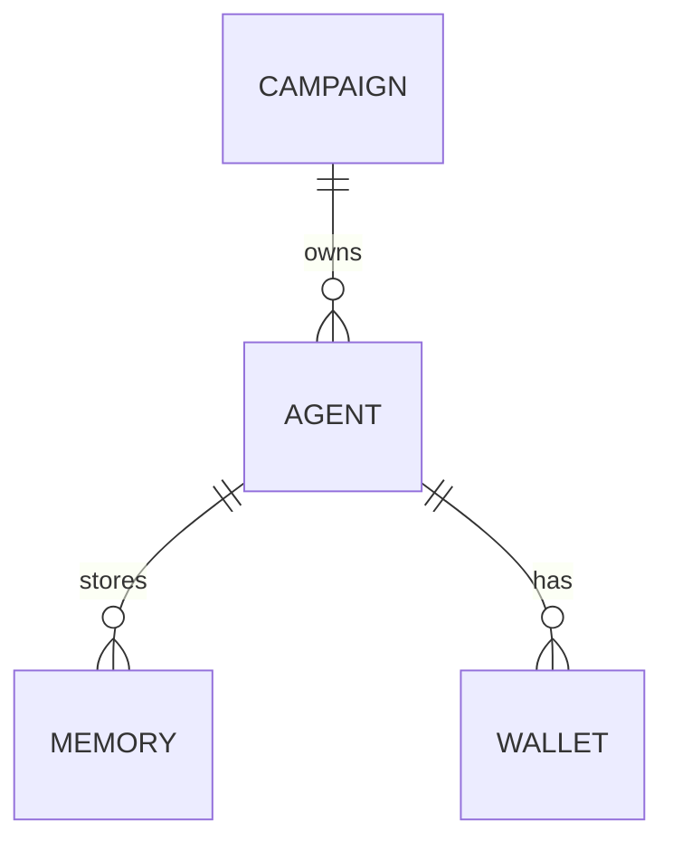

# Project Chimera - Technical Specs

## API Contracts (example)

### Trend Fetcher API
- Endpoint: `GET /api/trends?channel={channel}`
- Response JSON schema:

```json
{
  "trends": [
    {"id": "string", "title": "string", "score": 0.0, "metadata": {}}
  ]
}
```

### Skill I/O Contract (example)
- `skill_download_video(input: {"url": str}) -> {"status": "ok"|"error", "artifact": {"path": str}}

## Database ERD (Mermaid)


